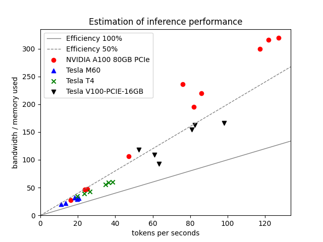

# LLM Generation token rate formula

A simple code for testing tokens_seconds ≈ memory_bandwidth / model_vram

## Results

Its seems that the memory-bounded asumption is right for large model and "old" 
GPU cards.



## Requirements

You will need to have access to a machine with an NVIDIA GPU.

## Installation

An installation script is available to install GPU requirements.

```
sudo apt install git
git clone https://github.com/loicveyssiere/llm_token_rate_formula.git

cd llm_token_rate_formula
chmod +x install.sh
./install.sh

# Potentially reboot
sudo reboot

# Potentially restart the script
cd llm_token_rate_formula
./install.sh
```

## Run

The main program is written in Python and executed multiple times with a bash
script.

```
chmod +x run.sh
./run.sh
```

## Cleanup

```
sudo docker compose down
rm ./data/ -rf
```

